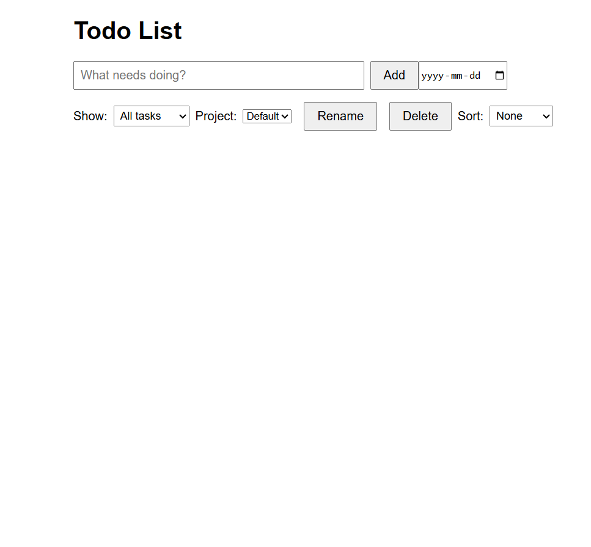

# Todo List

A simple, modular todo list application built with vanilla JavaScript and bundled using Webpack as part of [The Odin Project](https://www.theodinproject.com/) curriculum.

---

## Features

* **Modular structure**: Separate modules for data storage, project management, todo operations, and UI rendering.
* **Webpack bundling**: Configured entry/output, CSS handling with `style-loader` and `css-loader`, HTML template plugin, and a live dev server.
* **LocalStorage persistence**: Projects and todos persist across sessions.
* **Project management**: Create, rename, delete, and switch between multiple projects.
* **Todo operations**: Add, delete, mark complete, filter (all/upcoming/completed), and sort by due date.
* **Responsive UI**: Clean, accessible interface with minimal dependencies.

---

## Getting Started

### Install dependencies

```bash
npm install
```

### Run in development mode

```bash
npm start
```

This launches `webpack-dev-server` at `http://localhost:8080` with hot reloading.

### Build for production

```bash
npm run build
```

The optimized output will be in the `dist/` directory.

---


## Screenshot



---

## Testing

*No tests are included yet.*

*Future:* Write unit tests for pure functions (e.g., filtering and sorting) using Jest.

---

## Reflection

This Todo List project was the most involved I’ve tackled so far. I learned a great deal:

1. **Toolchain setup**

   * Configuring Webpack (loaders, plugins, dev server) and understanding asset pipelines.
2. **Modular design**

   * Separating concerns into `storage.js`, `project.js`, `todo.js`, and `ui.js` improved maintainability and clarity.
3. **State management & persistence**

   * Managing an in-memory `projects` array, a `currentProjectId` pointer, and persisting to `localStorage` taught me defensive programming and edge case handling.
4. **Filtering & sorting**

   * Building pure functions to filter and sort todos without mutating the original data reinforced immutability principles.
5. **Debugging**

   * Working through runtime errors (e.g., undefined properties) sharpened my debugging skills and comfort with browser dev tools.
6. **Persistence & iteration**

   * Iterating on features—project delete, sort, rename—over several days built my problem-solving resilience.

### Next steps

* Add Jest-based unit tests for core logic.
* Implement a "Due Today" filter and drag-and-drop reordering.
* Port the app to a front-end framework (React or Vue) to compare architecture.
* Enhance UI/UX with animations and accessibility improvements.

---

© 2025 Coady MacLellan. Licensed under MIT.
